# The Australian Library Browser

Desktop app for collecting material from Trove and SLWA into self-describing research libraries on disk.

Run it either way:

- packaged builds: [GitHub Releases](https://github.com/patrick-morrison/australian-library-browser/releases)
- from source: `npm install` then `npm start`

Built on April 1-2, 2026 as an experiment in spinning up a custom research browser. It is vibe-coded, so do not expect my usual standard. The tyres have been kicked, but use it at your own risk. I am writing the history of Wellington Dam, and this was built to speed up and improve the workflow for handling primary research notes.

The point of it is simple: save full-resolution images and markdown into a local library, keep the primary record on disk, and make that material searchable, summarisable, and cross-referenceable with help from Codex or Claude Code.

## Getting Started: Wellington Dam Case Study

This example uses a small Wellington Dam research task: find newspaper references to the dam, collect useful articles, ignore or uncollect false leads, then add an SLWA photograph to the same local research library.

### 1. Create a library

Open the app, choose **Library**, then click **New Library**. Name it something direct, such as `wellington-dam`. The app creates a normal folder on disk with a `.trovelibrary` manifest, `items.csv`, and subfolders for newspapers, images, notes, and debug material.

### 2. Search Trove newspapers

Switch to **Collect** and search Trove for `Wellington Dam` in Newspapers & Gazettes. Click **Save** on the toolbar once the search is useful. This records the search URL so you can come back to the exact result set later.

If Trove shows its cultural advice dialog, dismiss it in Trove before continuing.

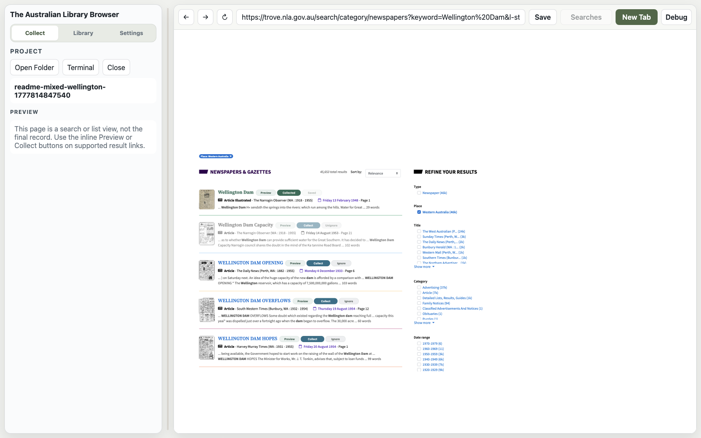

### 3. Preview, collect, ignore, or uncollect

Open a promising result. The left preview pane extracts the record metadata and text into markdown. Use:

- **Collect** when the record belongs in the project.
- **Ignore** when it is clearly irrelevant but may appear in future searches.
- **Uncollect** from the Library detail view if you collected something and later decide it should be removed from the active collection.

Collected and ignored decisions stay attached to matching records when they appear again.

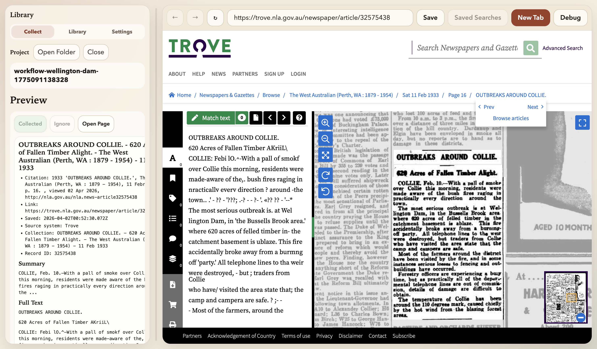

After collection, the preview pane changes state so you can see that the record has already been handled.

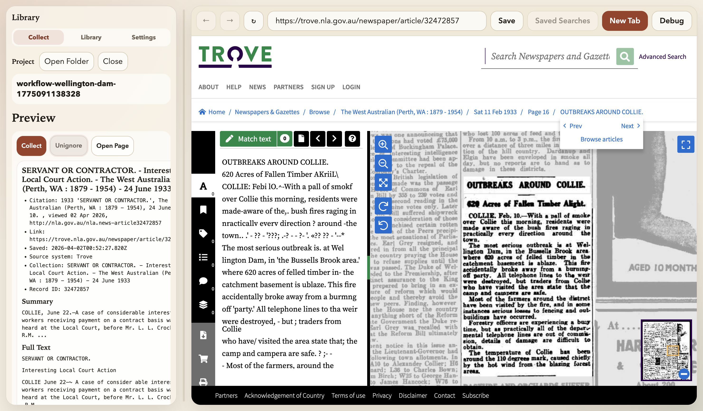

### 4. Add SLWA photographs

For images, search or open an SLWA record such as `Wellington Dam campsite`. The preview pane shows the photograph, source metadata, and extracted note content. Click **Collect** to save the full image plus a markdown sidecar into the library.

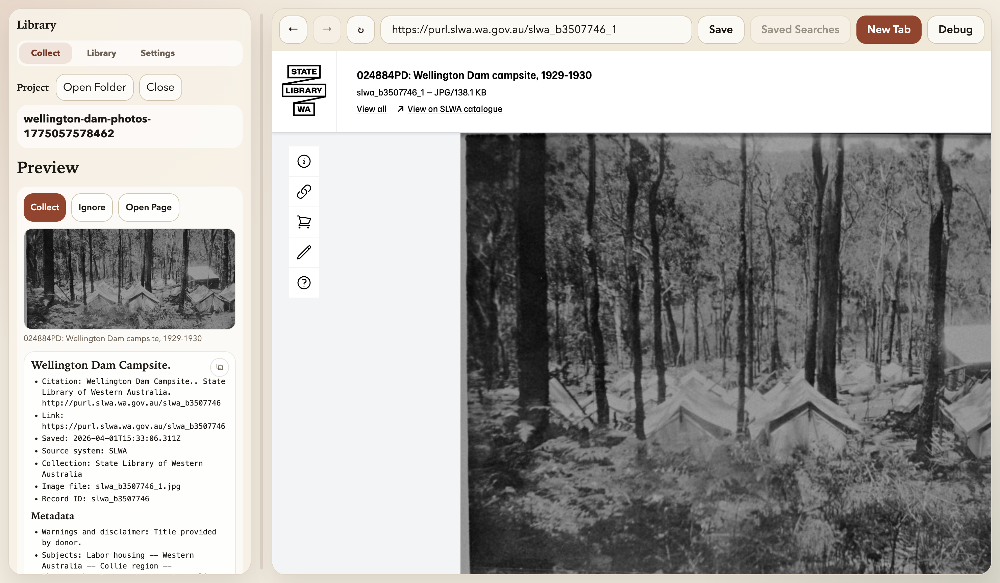

### 5. Review the local library

Switch to **Library** to review what you have collected. Use the filters for collected, ignored, and uncollected records; use Gallery for image records; use the newspaper calendar to browse Trove newspaper articles by date.

Everything remains in the project folder:

- newspaper articles as markdown in `newspapers/`
- image files and sidecar markdown in `images/`
- an inventory spreadsheet in `items.csv`
- project state in `project.yaml`

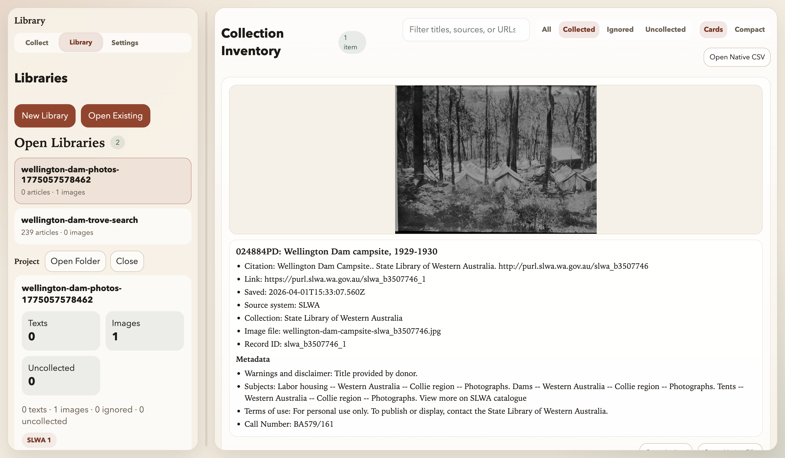

## Screenshots

Search live on Trove or SLWA, save the search, and work through results with inline controls.

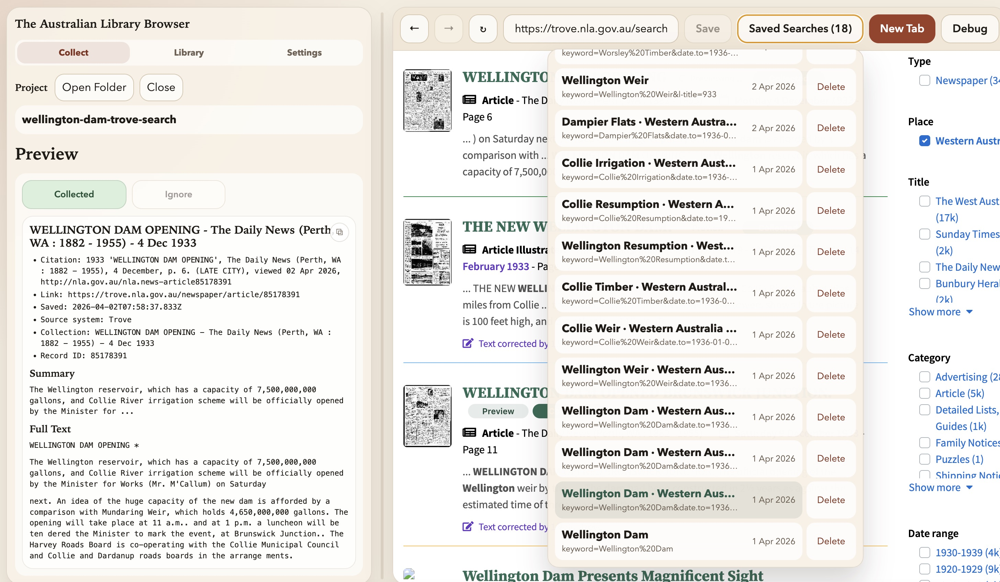

Preview a record before collecting it, with the extracted text or image shown in the side pane.

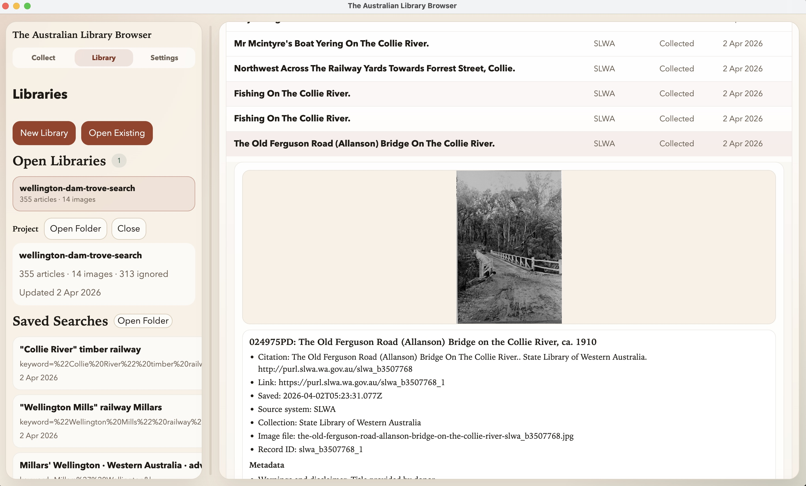

Collect or ignore as you go. Decisions stay attached to records when they turn up again in later searches.

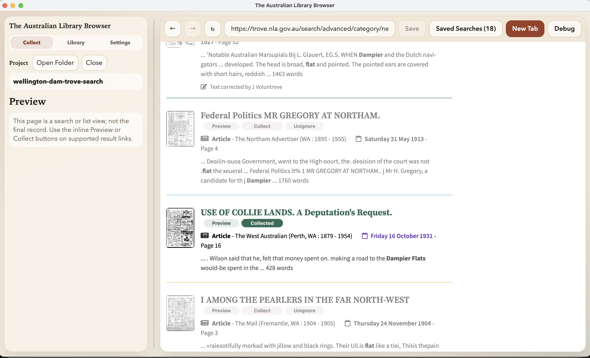

Work back through the local library, reopen saved searches, and inspect what has already been collected. In the end, it is all markdown and images in a folder on your local computer.

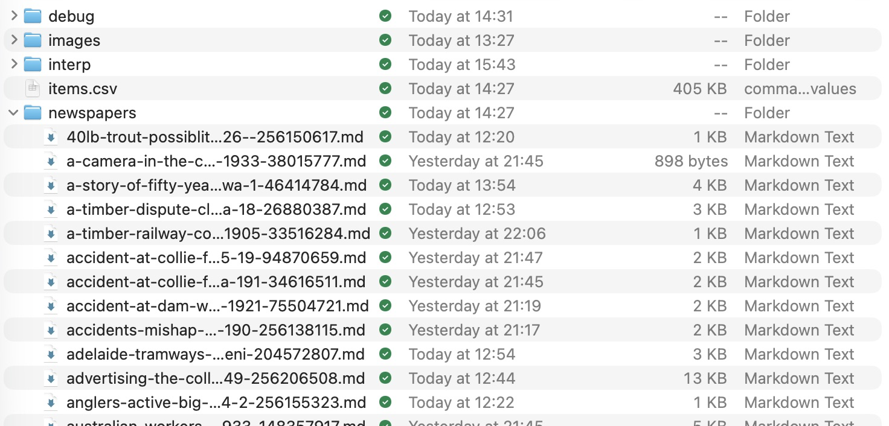

Paste research notes full of Trove or SLWA links, extract the URLs, and open unresolved ones for triage.

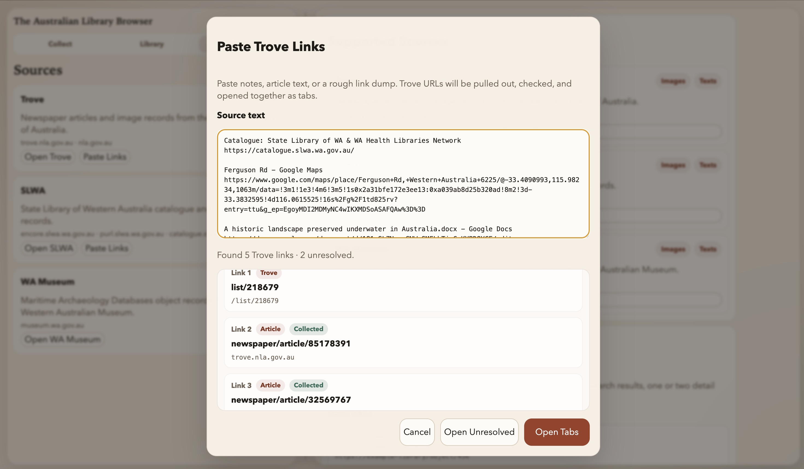

If you need to map a new site, save debug dumps of the page structure and build an unofficial adapter from that material.

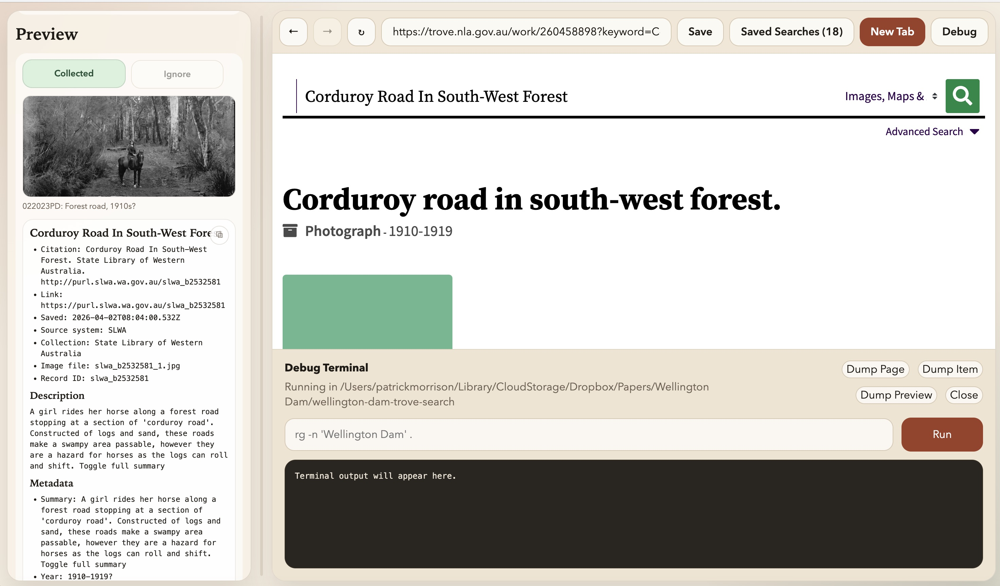

The screenshots live in `docs/screenshots/`.

Supported sources:

- `Trove`
- `SLWA`

Each library is a normal folder with a `.trovelibrary` manifest inside it.

Typical contents:

- `project.yaml` for project state
- `items.csv` for a flat inventory
- `README.md` for local notes
- `newspapers/` for markdown captures
- `images/` for downloaded images and sidecar markdown
- `debug/` for optional page dumps and reverse-engineering notes

## Workflow

Start with a search on Trove or SLWA, then save that search so there is a record of what you looked for. As you work through the results, collect or ignore records so there is a record of what you have already seen and decided on. Then change the search and keep going. Records you already made a decision on stay marked as collected or ignored when they turn up again in later searches.

You can preview items before collecting them. For Trove, that means traversing through to the full text and rendering it as markdown. For SLWA, it means pulling through to the image and associated record details. When you collect something, the app saves the result neatly into the local library with the metadata alongside it.

If you already have research notes full of Trove or SLWA links, there is a bulk import path. Paste the notes in, the app will extract the links, show which ones are already collected or ignored, and open the unresolved ones in tabs for triage.

The whole point is to move quickly through Trove and SLWA searches, keep local copies of what matters, keep a record of what has already been seen, and leave the metadata in a form that is easy to search and work across later.

## New Sites

There is a debug dump path for mapping the HTML of a new site you want to work on. The idea is to save page dumps into `debug/`, inspect the structure, and then quickly sketch an adapter from that material with help from Claude or Codex.

None of this is official. The source integrations are just pragmatic adapters around public pages.

## Development

```bash
npm install
npm start
```

Common commands:

```bash
npm run test:fixtures
npm run test:e2e:smoke
npm run test:mcp
npm run dist
npm run dist:mac
```

For agent/debug harness notes, see [`docs/HARNESS.md`](docs/HARNESS.md).

Open tabs from the CLI:

```bash
npm run open:tabs -- "https://trove.nla.gov.au/newspaper/article/32575438"
pbpaste | npm run open:tabs
```

Start the MCP server with:

```bash
npm run mcp:start
```

MCP tools:

- `list_projects`
- `create_project`
- `get_project_inventory`
- `read_item_markdown`
- `search_markdown`
- `save_project_note`
- `open_urls_in_tabs`
- `open_search_queries_in_tabs`

With MCP, Codex can read saved markdown in a library, identify names, places, dates or phrases worth following up, and open the next Trove or SLWA search tabs directly from those queries.

Notes:

- This repo does not ship downloaded research libraries or copied third-party page dumps.
- The package is currently `UNLICENSED`.
