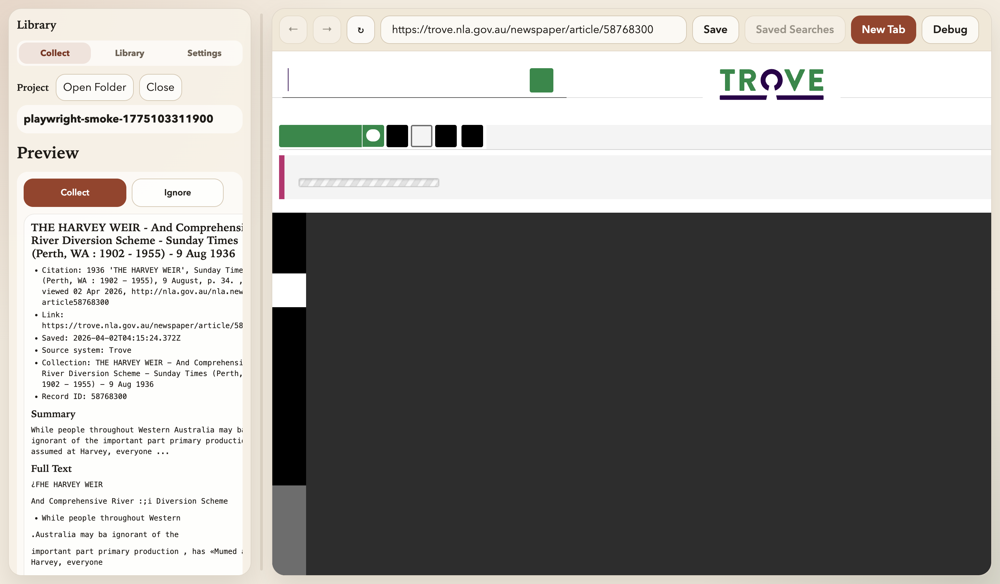
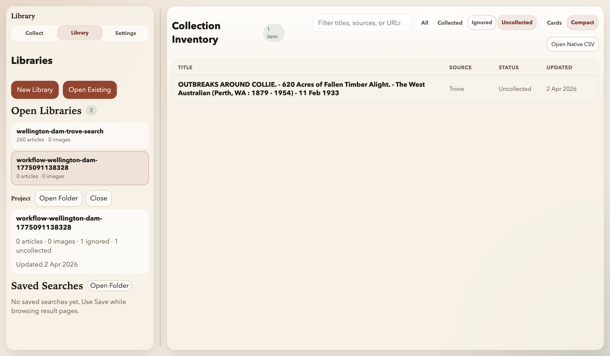
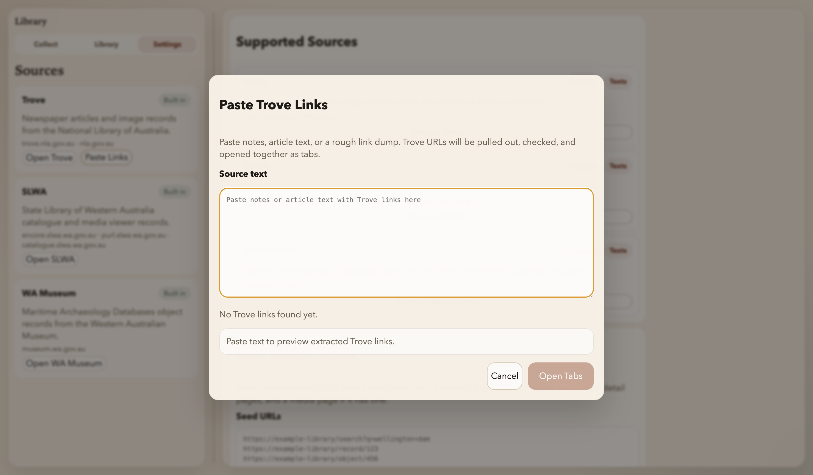

# The Australian Library Browser

Desktop app for collecting material from Trove, SLWA and the WA Museum into self-describing research libraries on disk.

Built on April 1-2, 2026 as an experiment in spinning up a custom research browser. It is vibe-coded, not up to my usual standard, and still rough around the edges. The tyres have been kicked, but use it at your own risk. I am writing the history of Wellington Dam, and this was built to speed up and improve the workflow for handling primary research notes.

## Screenshots







Supported sources:

- `Trove`
- `SLWA`
- `WA Museum` Maritime Archaeology Databases

Each library is a normal folder with a `.trovelibrary` manifest inside it.

Typical contents:

- `project.yaml` for project state
- `items.csv` for a flat inventory
- `README.md` for local notes
- `newspapers/` for markdown captures
- `images/` for downloaded images and sidecar markdown
- `debug/` for optional dumps

## Development

```bash
npm install
npm start
```

Common commands:

```bash
npm run test:fixtures
npm run test:e2e:smoke
npm run test:mcp
npm run dist
```

Open tabs from the CLI:

```bash
npm run open:tabs -- "https://trove.nla.gov.au/newspaper/article/32575438"
pbpaste | npm run open:tabs
```

Start the MCP server with:

```bash
npm run mcp:start
```

MCP tools:

- `list_projects`
- `create_project`
- `get_project_inventory`
- `read_item_markdown`
- `search_markdown`
- `save_project_note`
- `open_urls_in_tabs`
- `open_search_queries_in_tabs`

With MCP, Codex can read saved markdown in a library, identify names, places, dates or phrases worth following up, and open the next Trove or SLWA search tabs directly from those queries.

Notes:

- This repo does not ship downloaded research libraries or copied third-party page dumps.
- The package is currently `UNLICENSED`.
